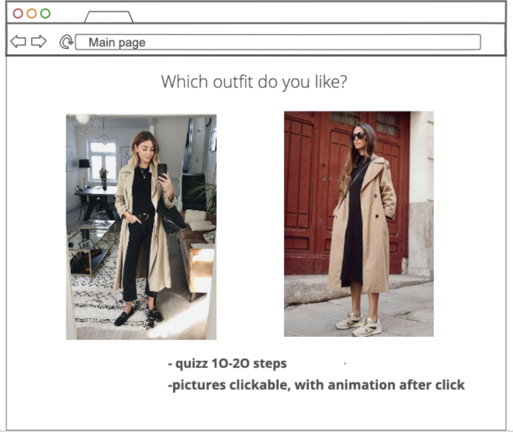
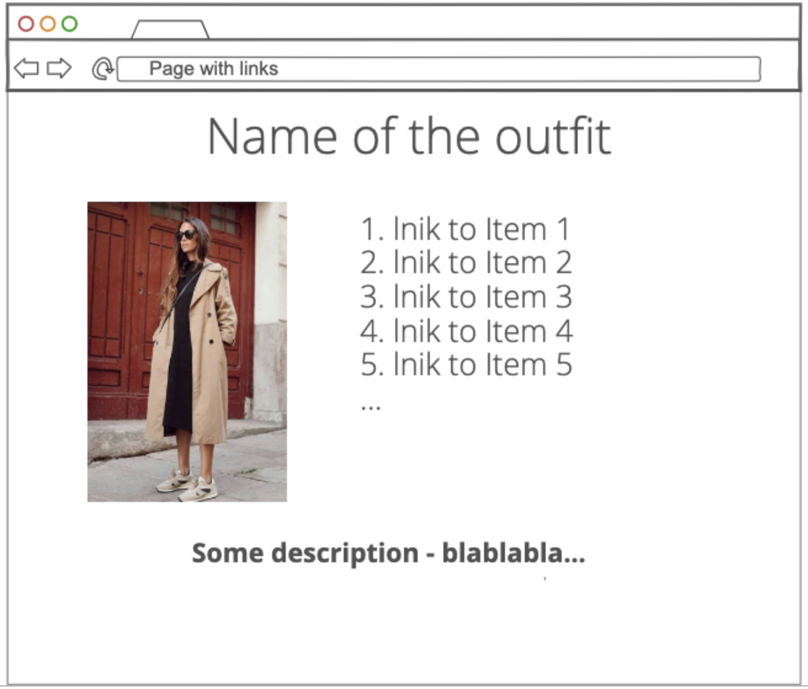

# REDI Sprint 2020 Frontend Development 2, Final Project

Application Name: StyleList

Student Name: Golovnev Sergei

## StyleList

My product StyleList allows users to find their basic wardrobe key pieces based on their style preferences. User goes through a quiz where they is asked to choose between 2 outfits, then the product picks 4 most frequently liked outfits and shown it to user. Then user clicks on them and the product provides list of items used on the pictures.

## Screenshots

## Features:

- displays photos with outfits in pairs
- allows user to click on the photo and records data about the user's choice (increases the counter of clicks for the photo)
- displays photos which user liked with a list of links, associated with the photo
